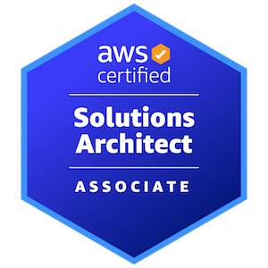

# Sehyun Kim (Paul)

AI-native full-stack developer focused on Java, Spring Boot, and AWS.

I diagnose backend bottlenecks using measurable evidence and improve systems through practical architectural decisions.   
Currently building a collaborative development environment and deployment workflow at [ScaleUpSquad](https://github.com/scaleup-squad).  

Passionate about music(I do bands), live performance, weightlifting, running, and socializing.  
I have a vision of making people more self-aware and confident through technology.

📫 How to reach me:
[Email](mailto:kimsparadise0202@gmail.com) 
[LinkedIn](https://www.linkedin.com/in/김세현3402)

## Professional Experience
### ScaleUpSquad — Full Stack Developer Intern
*Product Squad · Sep 2026 – Present*

- Reorganized a device-dependent AI agent workflow into a reproducible, device-independent development environment.
- Identified security risks in existing development workflows and implemented due measures.
- Implemented a four-stage delivery workflow across development, staging, and production environments.
- Improved onboarding documentation and repository initialization for cross-developer collaboration.
- Proposed terraform to manage AWS infrastructure

## Featured Projects

 ### All-In-Market
*E-commerce backend system · Apr 2026 – May 2026*

Java 21 · Spring Boot · MySQL · Redis · AWS ECS · Prometheus · Grafana

- Increased purchase throughput from **74.71 to 122.86 RPS**, a **64.4% improvement**.
- Identified database connection exhaustion and redundant locking as the
  primary bottlenecks using load tests and monitoring metrics.
- Removed redundant pessimistic locking while retaining distributed locking
  for multi-instance concurrency control.
- Added atomic inventory updates as the final safeguard against overselling.
- Designed an event delivery architecture using the Transactional Outbox
  pattern, SQS, idempotent consumers, and a DLQ.

[Repository](https://github.com/all-in-market) · [Architecture](https://github.com/all-in-market/.github/blob/main/image/AllInMarket-Architecture.png)

## Certifications

**AWS Certified Solutions Architect – Associate**  
Issued July 2026

## Education

**Chung-Ang University**, Seoul  
B.A. in Advertising and Public Relations · GPA 4.10/4.50  
Mar 2018 – Feb 2025

**Nanyang Technological University**, Singapore  
Exchange Student · Aug 2022 – Dec 2022

<!--
**ginsengcandy/ginsengcandy** is a ✨ _special_ ✨ repository because its `README.md` (this file) appears on your GitHub profile.

Here are some ideas to get you started:

- 🔭 I’m currently working on ...
- 🌱 I’m currently learning ...
- 👯 I’m looking to collaborate on ...
- 🤔 I’m looking for help with ...
- 💬 Ask me about ...
- 📫 How to reach me: ...
- 😄 Pronouns: ...
- ⚡ Fun fact: ...
-->
